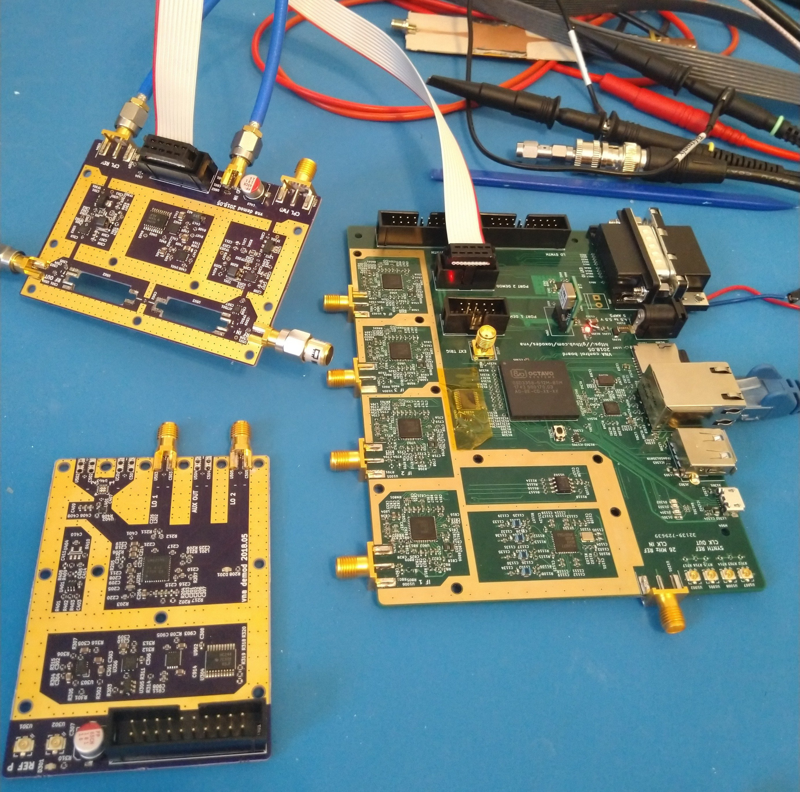
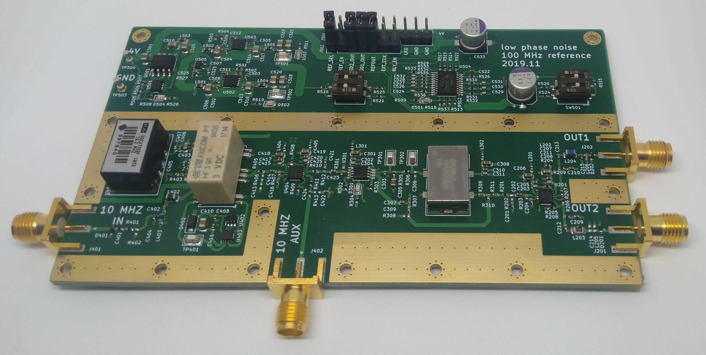
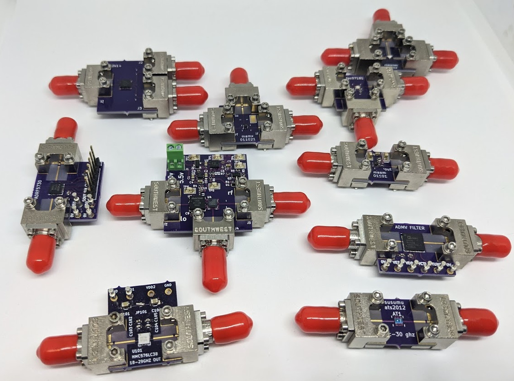

# Open Hardware Vector Network Analyzer
I'm developing a proof of concept two port microwave vector network analyzer. The project is under developent.
[Ongoing documentation and logs are located on a hackaday.io project page.](https://hackaday.io/project/26213-vector-network-analyzer)

## Usage
This project is still under development, y'all probably don't want to try reproducing it yet.
Two port measurements to 14 GHz work, a redesign for operation out to 36 GHz is in progress.

## Hardware Design
See `breakouts` and `hardware` for various modules developed for the network analyzer.

## Software Design
See the `software` directory for scraps of software written for testing VNA modules. 

## License
Unless otherwise noted, all work is under a MIT license.

## Contact
Feel free to contact me at arcticmicrowave@gmail.com or loxodes on irc.freenode.net
