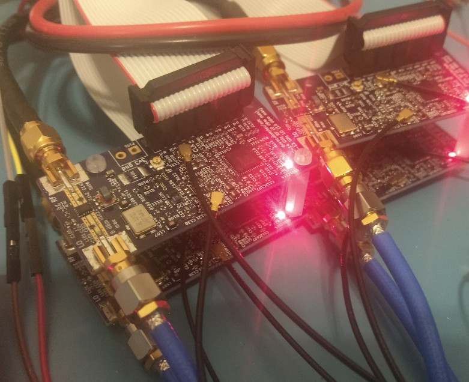

# Open Hardware Vector Network Analyzer
I'm developing a proof of concept two port microwave vector network analyzer. The project is under developent.
(Ongoing documentation and logs are located on a hackaday.io project page.)[https://hackaday.io/project/26213-vector-network-analyzer]

## Usage
This project is still under development, y'all probably don't want to try reproducing it yet.
Currently one port measurements are working out to 10 GHz. Testing with two port measurements out to 13 GHz is in progress.

## Hardware Design
See `breakouts` and `hardware` for various modules developed for the network analyzer.

All 4 layer PCBs are routed assuming OSH Park's 4 layer stackup (http://docs.oshpark.com/services/four-layer/) with FR-408 and 6.7 mil prepreg height. 
All layouts/schematics are created in KiCad 4

## Software Design
See the `software` directory for scraps of software written for testing VNA modules. 

## License
All work is under a MIT license.

## Contact
Feel free to contact me at jtklein@alaska.edu or loxodes in #rhlug on irc.freenode.net
