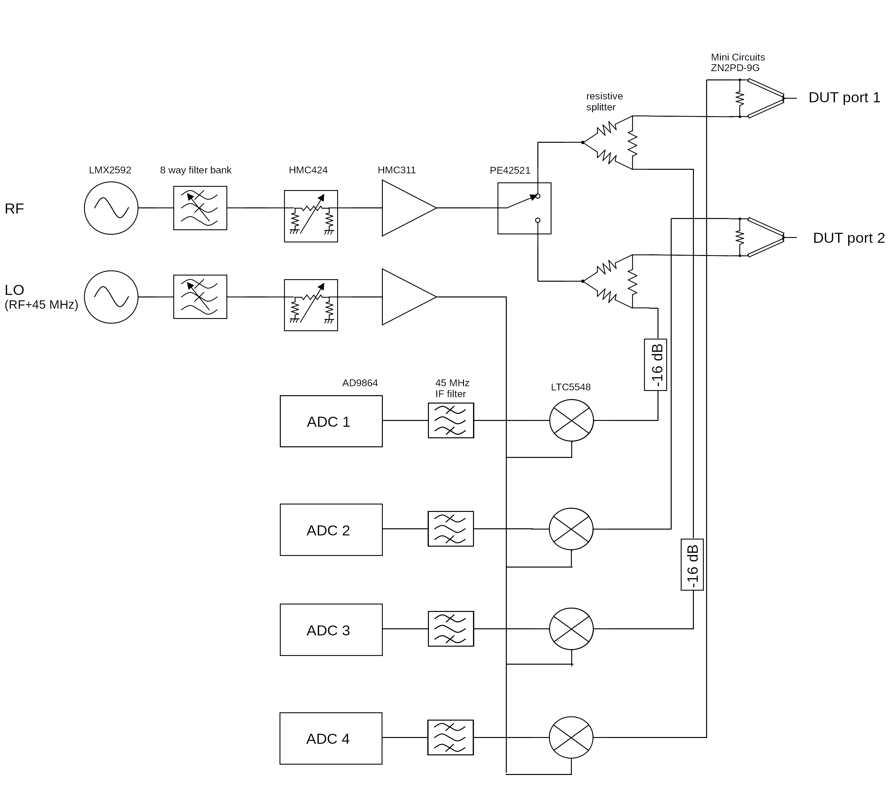

# Open Hardware Vector Network Analyzer
I'm developing a proof of concept two port microwave vector network analyzer. 
I don't have a working prototype yet system, I'm still developing and testing individual components of the design.

## Usage
This project is still under development, y'all probably don't want to try reproducing it yet.

Load `software\synth_test\synth_test.ino` on a MSP432 lauchpad.
Run `software\vna_cmd.py` for a console to control the launchpad. 

## Hardware Design

I'm still at the stage of testing individual modules (demodulators, synthesizers, filter banks, amplifiers, switches..).
See `breakouts` for various modules developed for the network analyzer.

| Breakout Name | Description   | Status |
| ------------- | ------------- | ------ |
| synth | 20 MHz to 10 GHz synthesizer | working! |
| switch | SPDT RF switch | sma footprint is terrible |
| splitter | 2 way splitter | sma footprint is terrible |
| powerdet | log power detector | sma footprint is terrible |
| filter breakout | filter bank | sma footprint is terrible |
| boosterpack | breakout board for booster pack | working! |
| attenuator | variable attenuator | working! |
| amp | broadband amplifier | partially working, resonance at 4 GHz.. |
| demod | quadrature demodulator | working up to output buffer.. |
| adc_dual | dual adc | untested | 
| refclk | PLL reference clock | working! |
The edge launch SMA connector footprint on some boards results in high reflection above 2 GHz due to the excess pad width relative to 50 ohm microstrip.. 

Breakout boards are combined into modules.. I'm currently working on a synthesizer module.

| Module Name | Description   | Status |
| ----------- | ------------- | ------ |
| hardware/frequency_synth | Frequency synthesizer with filtered harmonics and closed loop amplitude control | assembled, untested |
| hardware/switch_demod    | I/Q demodulator, adc, LO splitting, and rf switching for DUT connectors | schematic in progress | 

All 4 layer PCBs are routed assuming OSH Park's 4 layer stackup (http://docs.oshpark.com/services/four-layer/) with FR-408 and 6.7 mil prepreg height. 
All layouts/schematics are created in KiCad 4.0.2

## Software Design
See the `software` directory for scraps of software written for testing VNA modules. 
Possibly of interest to others is the code in `synth_test.ino` for using the LMX2592 synthesizer.  

## License
All work is under a MIT license.

## Contact
Feel free to contact me at jtklein@alaska.edu or loxodes in #rhlug on irc.freenode.net
