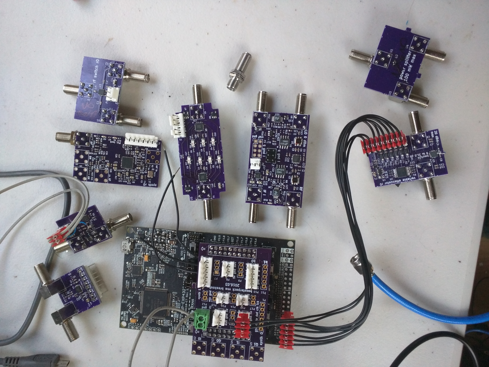
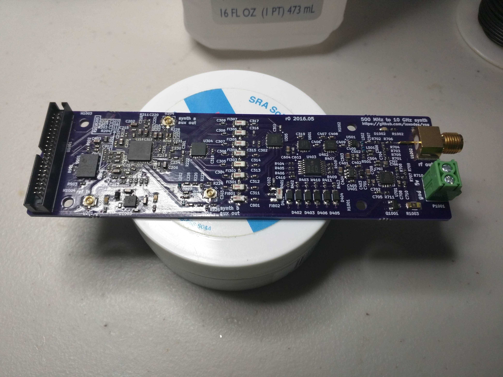

# Open Hardware Vector Network Analyzer
I'm developing a proof of concept two port microwave vector network analyzer. The project is under developent.

## Usage
This project is still under development, y'all probably don't want to try reproducing it yet.

Run `software/vna_controller/adc_bbone_init.py` and `software/vna_controller/pru_test/run.sh` on the Beaglebone,
then run `software/vna_controller/vna_driver.py` to start the VNA. 

## Hardware Design

I'm still at the stage of testing individual modules (demodulators, synthesizers, filter banks, amplifiers, switches..).
See `breakouts` for various modules developed for the network analyzer.

Breakout boards are combined into modules.. 

| Module Name | Description   | Status |
| ----------- | ------------- | ------ |
| hardware/frequency_synth | Frequency synthesizer with filtered harmonics and closed loop amplitude control | appears to work! |
| hardware/demod_adc | I/Q demodulator/adc | assembled, testing in progress | 

All 4 layer PCBs are routed assuming OSH Park's 4 layer stackup (http://docs.oshpark.com/services/four-layer/) with FR-408 and 6.7 mil prepreg height. 
All layouts/schematics are created in KiCad 4

## Software Design
See the `software` directory for scraps of software written for testing VNA modules. 
Possibly of interest to others is the code in `synth_test.ino` for using the LMX2592 synthesizer.  

## License
All work is under a MIT license.

## Contact
Feel free to contact me at jtklein@alaska.edu or loxodes in #rhlug on irc.freenode.net
